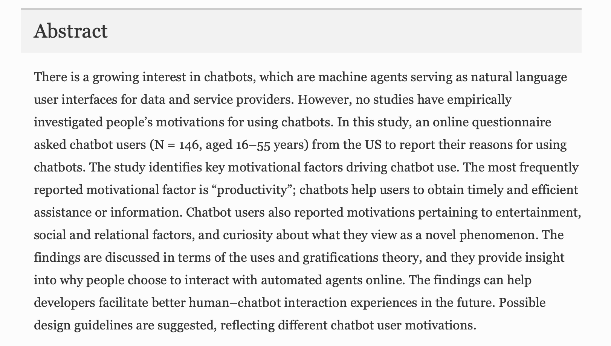

# Les Chat-Bots:

## Utilités et Emplois

Une ou deux lignes qui expliquent ce qu'on retrouve dans cette classe. Ensuite, publication des différentes ressources trouvées

### BISEUL, Xavier. Chatbot, Voicebot, Socialbot, Metabot : les 4 usages du bot. Dans : Silicon [en ligne]. 13 février 2019. [Consulté le 8 mai 2019]. Disponible à l’adresse : https://www.silicon.fr/dossiers/chatbot-voicebot-socialbot-metabot-les-4-usages-du-bot?description=Les%20agents%20conversationnels%20entrent%20dans%20une%20phase%20de%20maturité.%20Ils%20ont%20gagné%20en%20performances%20tout%20en%20faisant%20appel%20à%20la%20voix%20pour%20faciliter%20les%20échanges.%20Tour%20d'horizon%20des%20différents%20cas%20d'usage.

Lien dans la référence

### BRANDTZAEG, Petter Bae et FØLSTAD, Asbjørn. Why People Use Chatbots. Dans : KOMPATSIARIS, Ioannis, CAVE, Jonathan, SATSIOU, Anna, CARLE, Georg, PASSANI, Antonella, KONTOPOULOS, Efstratios, DIPLARIS, Sotiris et MCMILLAN, Donald (dir.), Internet Science. Vol. 10673 [en ligne]. Cham : Springer International Publishing, 2017, p. 377‑392. [Consulté le 28 mai 2019]. ISBN 978-3-319-70283-4. DOI 10.1007/978-3-319-70284-1_30

### SHAWAR, Bayan Abu et ATWELL, Eric. Chatbots: Are they Really Useful? Zeitschrift für Computerlinguistik und Sprachtechnologie GLDV-Journal for Computational Linguistics and Language Technology. 2007, Vol. 22, no 1, p. 29‑49

[SHAWAR, Bayan Abu et ATWELL, Eric. Chatbots: Are they Really Useful?](image_folder/bd-les_chat-bots-uti_emplois/chatbots_are_they_really_useful.pdf)

### VEN, Eric Le. Chatbot, la nouvelle expérience conversationnelle. Archimag: les technologies de l’information [en ligne]. Avril 2018, no 313, p. p.30-31. [Consulté le 8 mai 2019]. Disponible à l’adresse : http://catalogue.iessid.be/index.php?lvl=bulletin_display&id=6454. 027AR Archives, archivistique

[VEN, Eric Le. Chatbot, la nouvelle expérience conversationnelle](image_folder/ba-les_chat-bots-def/chatbot-nouvelle_experience_conversationelle-archimag_313-avril-2018.pdf)

### VERETSKAYA, Olga. What is a Chatbot and How to Use It for Your Business. Dans : https://anadea.info [en ligne]. 29 décembre 2017. [Consulté le 8 mai 2019]. Disponible à l’adresse : https://anadea.info/blog/what-is-a-chatbot-and-how-to-use-it-for-business

[VERETSKAYA, Olga. What is a Chatbot and How to Use It for Your Business](image_folder/bd-les_chat-bots-uti_emplois/what_is_chatbot_and_how_to_use_it_for_your_business-anadea.pdf)

### XU, Anbang, LIU, Zhe, GUO, Yufan, SINHA, Vibha et AKKIRAJU, Rama. A New Chatbot for Customer Service on Social Media. Dans : Proceedings of the 2017 CHI Conference on Human Factors in Computing Systems  - CHI ’17 [en ligne]. Denver, Colorado, USA : ACM Press, 2017, p. 3506‑3510. [Consulté le 28 mai 2019]. ISBN 978-1-4503-4655-9. DOI 10.1145/3025453.3025496

[U, Anbang, LIU, Zhe, GUO, Yufan, SINHA, Vibha et AKKIRAJU, Rama. A New Chatbot for Customer Service on Social Media](image_folder/bd-les_chat-bots-uti_emplois/new_chatbot_for_customer_service .pdf)
