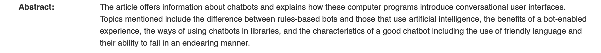

# Les Chat-Bots en bibliothèques

### Organisation du dossier et des ressources:

##### 1. IA, Bots, Chat-Bots et Voice-Bots: <em>Que sont-ils ? En quoi sont-ils différents ?</em>

a. [Définitions](aa-ia_bots_chat-bots_voice-bots-def.md)

b. [Pour aller plus loin](ab-ia_bots_chat-bots_voice-bots-plus_loin.md)

##### 2. Les Chat-Bots

a.	[Définitions](ba-les_chat-bots-def.md)

b.	[Comment cela fonctionne-t-il?](bb-les_chat-bots-comment_ça_fonctionne.md)

c.  [Comment mettre au point un Chat-Bot?](bc-les_chat-bots-comment_creer_chat-bots.md)

d.	[Utilités et emplois](bd-les_chat-bots-uti_emplois.md)

e.  [Quel(s) Chat-Bot(s) employer?](be-les_chat-bots-quel_employer.md)

##### 3. [Les Chat-Bots en bibliothèques](c-chat-bots_en_biblio.md)

# Les Chat-Bots en bibliothèques

<em>En quoi les IA et les Bots ont-ils leur place dans les bibliothèques?</em>

### ACCART, Jean-Philippe. La médiation à l’heure du numérique. Paris : Editions du Cercle de la librairie, 2016. Bibliothèques. ISBN 978-2-7654-1505-3. Disponible à l’adresse : http://catalogue.iessid.be/index.php?lvl=notice_display&id=21752

A trouver

### ALLISON, DeeAnn. Chatbots in the library: is it time? Library Hi Tech [en ligne]. Mars 2012, Vol. 30, no 1, p. 95‑107. [Consulté le 28 mai 2019]. DOI 10.1108/07378831211213238

[ALLISON, DeeAnn. Chatbots in the library: is it time?](image_folder/c-chat-bots_en_biblio/chatbots_in_library_is_it_time.pdf)

### AMAR, Muriel et MESGUICH, Véronique. Le web 2.0 en bibliothèques. Quels services ? Quels usages ? Paris : Editions du Cercle de la librairie, DL 2009. ISBN 978-2-7654-0976-2. Disponible à l’adresse : http://catalogue.iessid.be/index.php?lvl=notice_display&id=18450

A trouver

### BRAMMER, Robert et MEHLHORN, Saskia. ASK YOUR FRIENDLY LIBRARY CHATBOT: How to create and build your own law library chatbot for your organization. AALL Spectrum. Juin 2019, Vol. 23, no 5, p. 14‑17

### FICHTER, Darlene et WISNIEWSKI, Jeff. Chatbots Introduce Conversational User Interfaces. Online Searcher. Février 2017, Vol. 41, no 1, p. 56‑58

### GAUDIN, Frédérique. Reponseatout.ca : le service québécois de référence virtuelle. Argus: Bibliothèque, technologie(s) et numérique [en ligne]. Printemps 2018, Vol. 46, no 1, p. 43-49 (7 p.). [Consulté le 28 mai 2019]. Disponible à l’adresse : http://catalogue.iessid.be/index.php?lvl=notice_display&id=22616

A trouver

### HILT, Kailee. What Does the Future Hold for the Law Librarian in the Advent of Artificial Intelligence? Canadian Journal of Information & Library Sciences. Septembre 2017, Vol. 41, no 3, p. 211‑227

### MCKIE, Indra et AALIA, Bhuva Narayan. Put Uncle Google and Auntie Alexa to work in your library. inCite. Décembre 2018, Vol. 39, no 11/12, p. 30‑31

### MCNEAL, Michele L. et NEWYEAR, David. Introducing Chatbots in Libraries. Library Technology Reports. Décembre 2013, Vol. 49, no 8, p. 5‑10

### MESGUICH, Véronique. Le chatbot va-t-il ringardiser le site Web ? Dans : Bibliothèques : le Web est à vous. Paris : Editions du Cercle de la librairie, DL 2017, p. 16-17. Bibliothèques. ISBN 978-2-7654-1521-3. Disponible à l’adresse : http://catalogue.iessid.be/index.php?lvl=notice_display&id=21806

A trouver

### TEXIER, Bruno. Jean-Marc Ogier: « De larges perspectives pour les entreprises ». Archimag: les technologies de l’information. Avril 2016, no 293, p. 19‑20

[TEXIER, Bruno. Jean-Marc Ogier: « De larges perspectives pour les entreprises »](image_folder/c-chat-bots_en_biblio/dossier-intelligence_artificielle-archimag_293-avril_2016.pdf)

### TEXIER, Bruno. L’intelligence artificielle: croquez dedans ! Archimag: les technologies de l’information. Avril 2016, no 293, p. 17‑18

[TEXIER, Bruno. L’intelligence artificielle: croquez dedans !](image_folder/c-chat-bots_en_biblio/dossier-intelligence_artificielle-archimag_293-avril_2016.pdf)

### TEXIER, Bruno. Quand le document se dope à l’intelligence artificielle. Archimag: les technologies de l’information. Avril 2016, no 293, p. 22

[TEXIER, Bruno. Quand le document se dope à l’intelligence artificielle](image_folder/c-chat-bots_en_biblio/dossier-intelligence_artificielle-archimag_293-avril_2016.pdf)
